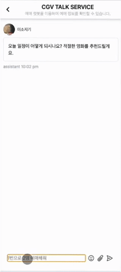
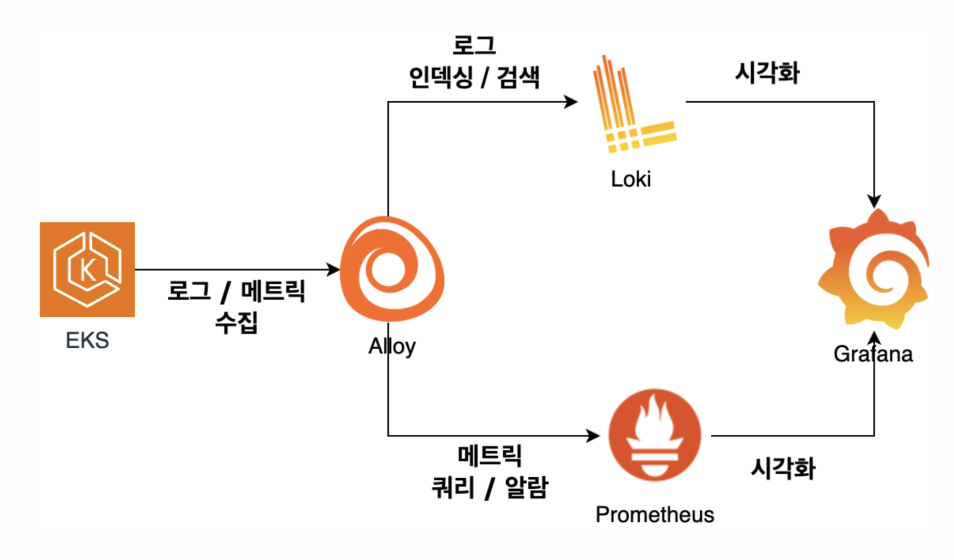
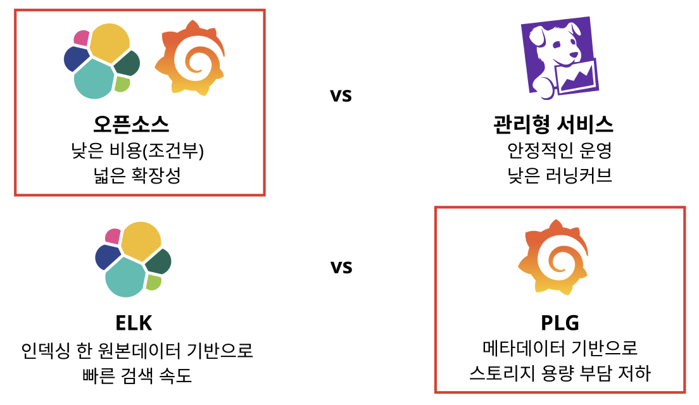
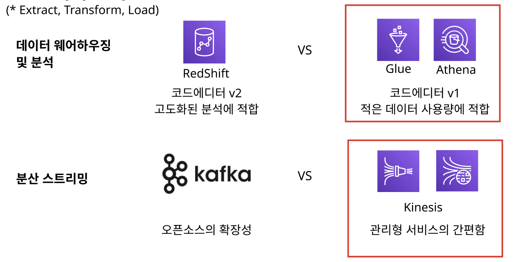
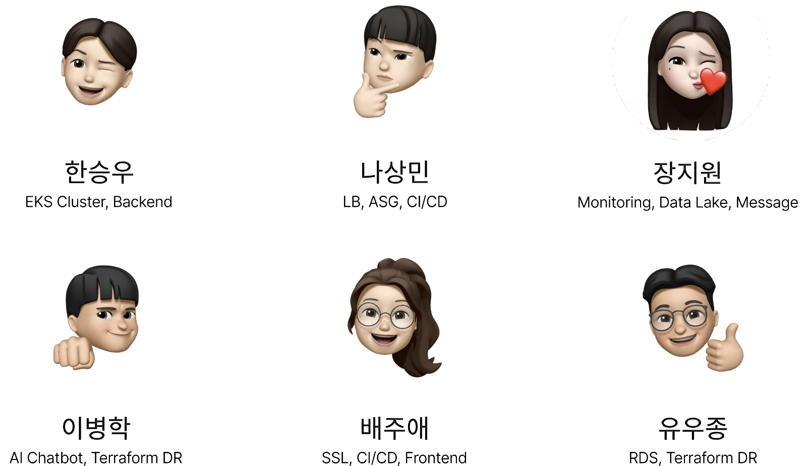

# Yes I Can - CGV 챗봇 예매

  

## 프로젝트 소개
### 계기
---
영화관 아르바이트를 하며 직접 목격한 어르신 분들의 예매 과정에서의 불편함을 해결하고자 챗봇을 이용한 채팅 및 음성 예매 서비스를 구현하였습니다.

인식한 문제점과 선택한 해결 방안
---
**1. 보안 문제**
   * 웹 애플리케이션을 보호하기 위해 `WAF` 활용
   * `IAM` 사용자의 `Access Key`를 순환시키기 위해 `Secret Manager` 활용
   * 데이터 암호화를 위한 키를 생성 및 관리하기 위해 `KMS` 활용
   * 사용자를 세분화하고 최소 권한을 부여하기 위해 `IAM` 활용
     
**2. 비용 문제**
   * `Cluster Node`의 인스턴스 유형 최적화 (e.g. 최소 11 개의 포드가 필요한 노드의 인스턴스 타입을 `t3.medium`으로 설정)
   * `EC2 스팟 인스턴스`를 활용해 `Jenkins CI`를 구축하여 `온디맨드 인스턴스` 대비 최대 90% 비용 절약

**3. 가용성 문제**
   * 트래픽을 분산시키기 위해 `ALB` 활용
   * `Kubernetes` 환경에서의 고가용성을 위해 `HPA`, `Karpenter` 활용
   * `Database`의 고가용성을 위해 `Aurora Cluster`, `Read Replica` 활용

## 사용법 및 시나리오

### 1. 채팅 및 음성을 통한 예매
1. 사용자는 챗봇과 채팅 및 음성을 통해 영화 주변 영화관을 탐색
2. 조건에 맞는 영화 및 영화관 정보를 제공
3. 예매 확정
4. 예매 내역을 문자로 전송

### 2. 일반 좌석 예매
1. 사용자는 영화관 좌석 예매 페이지에서 원하는 좌석 선택
2. 예매 확정
3. 예매 내역을 문자로 전송

### 3. 채팅 예매 시연 화면

## 전체 아키텍처

아키텍처는 크게 **Production 환경**, **Dev 환경**, 그리고 재난 방지를 위한 **DR** 3종류로 구성되어 있습니다.

### Production 환경

사용자가 시스템에 접근하여 서비스를 이용하게 되는 환경입니다. 때문에 아래의 3가지를 중점적으로 production 환경을 구축하였습니다.

**1. 대규모 예매 트래픽을 대비한 높은 확장성과 가용성**
- Kubernetes
 frontend와 backend 서버를 구성하는 쿠버네티스 환경에서는 `ReplicaSet`, `HPA`, `Karpenter` 3가지 리소스로 고가용성을 확보하였습니다. 또한 `Karpenter`를 사용하여 일반 `쿠버네티스 CA` 대비 약 2배 빠른 Scaling 속도를 확보하였습니다.

    
<!-- 임시 주석 처리  -->

  - Database
 `Aurora Cluster`를 사용하여 장애 발생 시 `Read Replica`의 빠른 failover를 확보하였습니다.
`Read Replica`로 읽기, 쓰기 작업을 분리하여 부하를 분산시켰습니다. 
    
<!-- 임시 주석 처리  -->

**2. 장애 및 보안 위협 예방과 신속한 대응을 위한 모니터링**

- 서비스 모니터링을 위해 로그와 메트릭 정보를 수집하여 분석 및 시각화합니다.

[로그]
> 서비스 -> Alloy -> Loki -> Grafana

1. 서비스의 로그는 Alloy를 통해 수집합니다.
   1. 이전에 로그 수집에 주로 사용되던 Promtail이 공식적으로 점진적인 지원 종료가 발표됨에 따라 Alloy를 사용하였습니다.
   > "Promtail is now deprecated and will enter into Long-Term Support (LTS) beginning Feb. 13, 2025. This means that Promtail will no longer receive any new feature updates, but it will receive critical bug fixes and security fixes." - [Promtail](https://grafana.com/docs/loki/latest/send-data/promtail/ "Promtail")
  
2. 수집된 로그는 Loki를 통해 인덱싱하며 검색합니다.
3. 필터링된 로그는 Grafana를 통해 시각화합니다.

[메트릭]
> 서비스 -> Alloy -> Prometheus -> Grafana

1. 서비스의 메트릭은 Alloy를 통해 수집합니다.
2. Prometheus와 alert manager을 통해 메트릭을 쿼리하며 알람을 전송합니다.
3. Grafana로 가공된 메트릭 데이터를 시각화합니다.

<서비스 비교>

1. 모니터링 서비스는 비교적 낮은 비용과 넓은 설정 범위로 인해 확장성이 높은 오픈소스를 선택하였습니다.
2. 오픈 소스 서비스 중에서는 메타데이터 기반으로 보다 더 가볍게 데이터를 선별하여 가공할 수 있는 PLG를 스택을 사용하였습니다.

**3. 인공지능 학습을 위한 데이터 ETL 파이프라인**

- 챗봇에 사용되는 인공지능 학습을 위해 AWS를 통해 서버리스로 ETL 파이프라인을 구축하였습니다. (Extract, Transform, Load)
- 개발자는 가공된 데이터를 통해 AWS의 Personalize, 제작한 모델 등에 활용하여 개인화된 서비스 제공이 가능해집니다.

[데이터 수집, 가공, 저장]
> Kinesis -> S3 -> Glue -> Athena -> S3

1. 데이터 분석에 적합하거나 주요한 데이터들은 Kinesis Data Streams를 통하여 동작합니다. 이를 통해 안정성을 높일 수 있으며 실시간 처리가 용이해집니다.
2. Kinesis Data Firehose를 통해 Kinesis Data Streams의 원본 로그를 수집하여 S3로 전송합니다.
3. Glue는 S3에 저장된 원본 로그 데이터를 가져와 쿼리에 적합하게 가공합니다.
4. Athena는 Glue가 가공한 데이터를 쿼리합니다.
5. 쿼리 결과는 최종적으로 S3에 저장됩니다.

<서비스 비교>

1. 데이터 웨어하우징 및 분석에는 보다 더 고도화된 RedShift가 있습니다. 하지만, 분석의 중요성이 비대하지 않은 서비스 상황에서는 우선적으로 Glue & Athena를 도입하는 것이 경제적이라고 판단하였습니다. 
   1. 추후 데이터 분석의 중요성이 증가하거나, 서비스가 성장하였을 때 Redshift로의 전환을 계획하고 있습니다.
2. 분산 스트리밍 서비스에는 많은 레퍼런스와 확장성을 지닌 오픈소스인 Kafka가 고려되었습니다.
   1. 하지만, 다른 AWS 서비스와의 연동이 중요하고, 데이터 관리 및 분석이 아직 낯선 상황에서는 관리형 서비스인 Kinesis가 더욱 적합하다고 판단하였습니다.

## 기술 스택
**1. Jenkins + ArgoCD (CI/CD)**  

## 팀 소개

